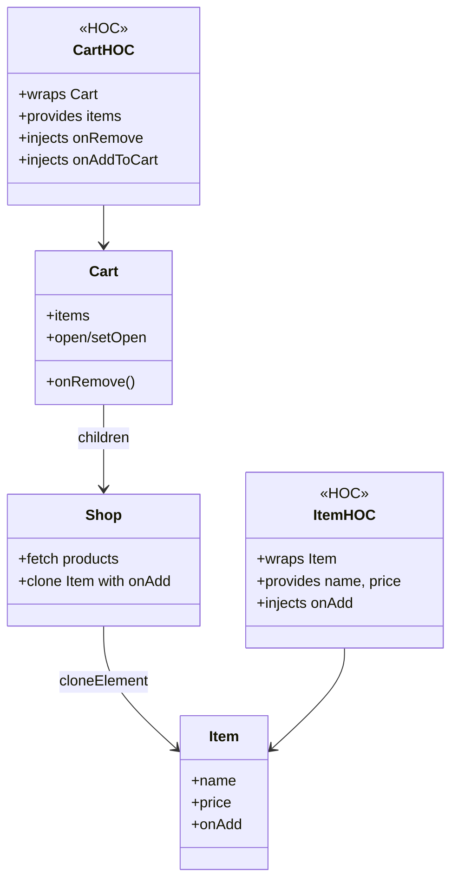

# State Handling


## Instructions

```bash
git clone https://github.com/miwashi-edu/edu-react-state.git
cd edu-react-state
npm install
npm run storybook
```

## Usage


### With Test Storage

```jsx
import {Shop} from "./components/Shop";
import {CartWithTestStorage} from "./components/Cart";
<CartWithTestStorage>
    <Shop>
        <Item />
    </Shop>
</CartWithTestStorage>
```

### With local storage

```jsx
import {Shop} from "./components/Shop";
import {CartWithLocalStorage} from "./components/Cart";
<CartWithLocalStorage>
    <Shop>
        <Item />
    </Shop>
</CartWithLocalStorage>
```

### With backend storage

```jsx
import {Shop} from "./components/Shop";
import {CartWithBackend} from "./components/Cart";
<CartWithBackend>
    <Shop>
        <Item />
    </Shop>
</CartWithBackend>
```

### With different Item

```jsx
import {Shop} from "./components/Shop";
import {CartWithBackend} from "./components/Cart";
<CartWithBackend>
    <Shop>
        <ItemWithImage />
    </Shop>
</CartWithBackend>
```


## What is a Higher-Order Component (HOC)?

A **Higher-Order Component (HOC)** is a function that takes a component and returns a new component. It's used to inject behavior, data, or props without modifying the original component.

```jsx
const withBehavior = (Component) => (props) => {
    const extra = useSomething();
    return <Component {...props} extra={extra} />;
};
```



